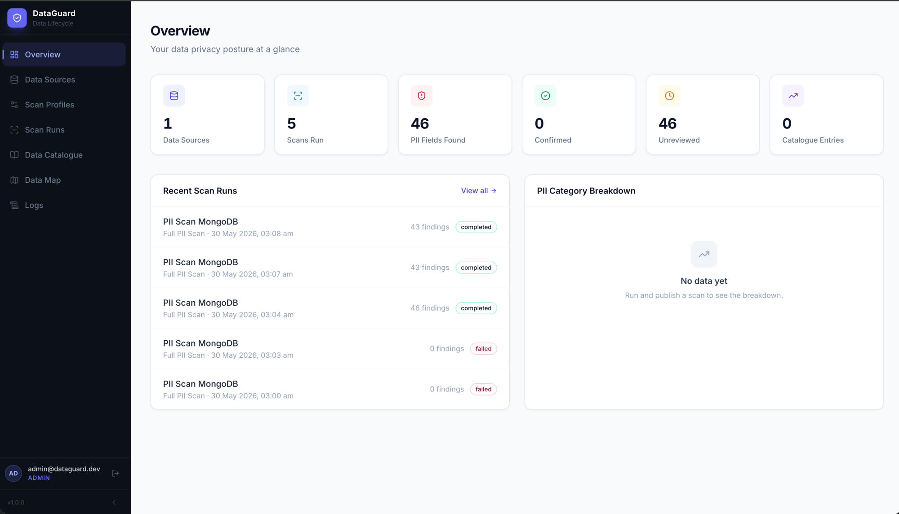
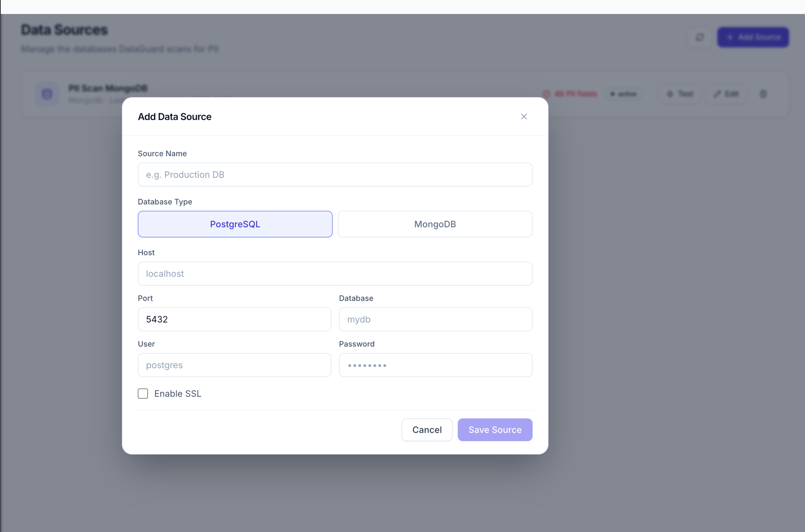
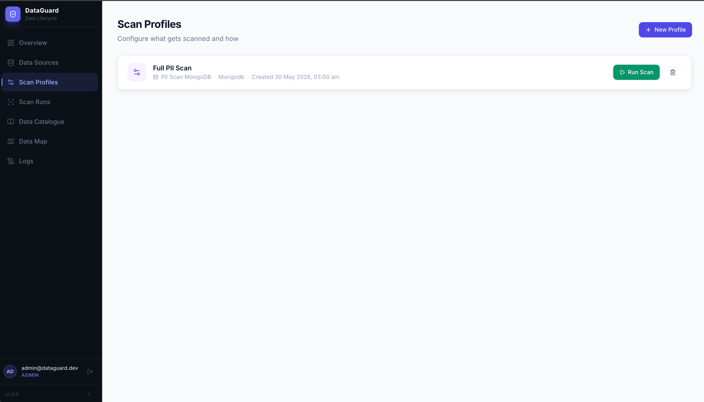
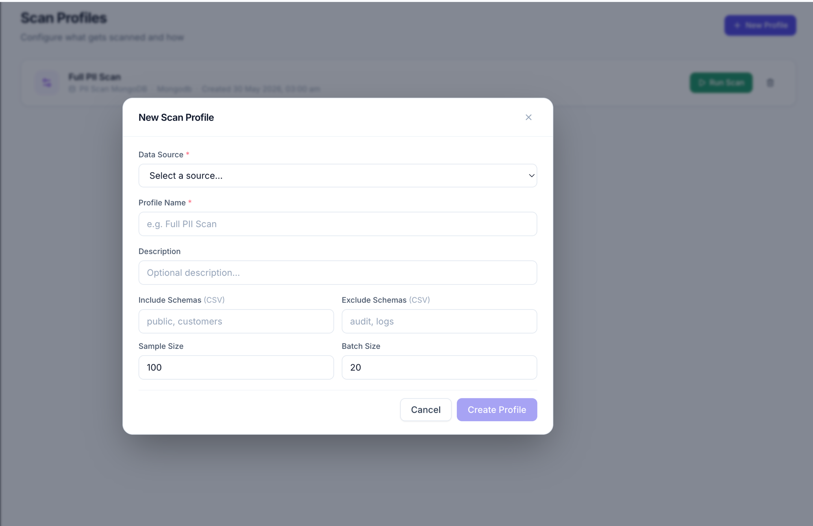
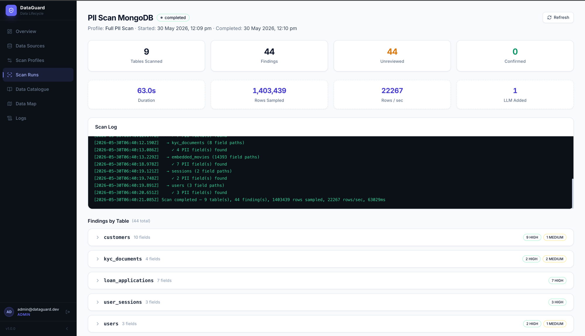
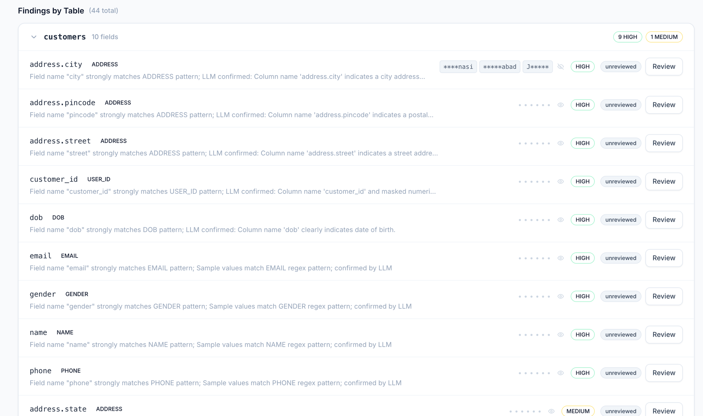
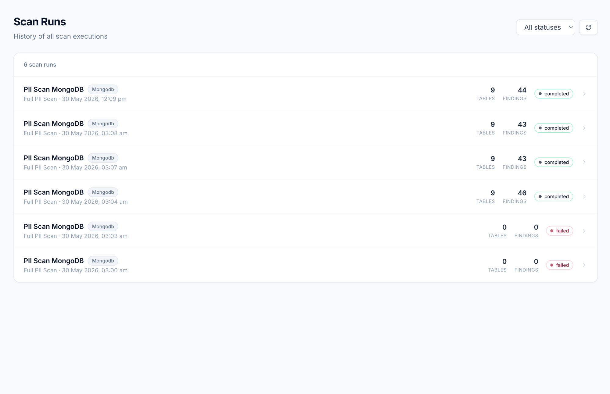
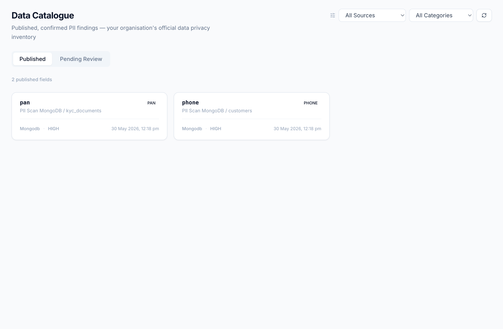
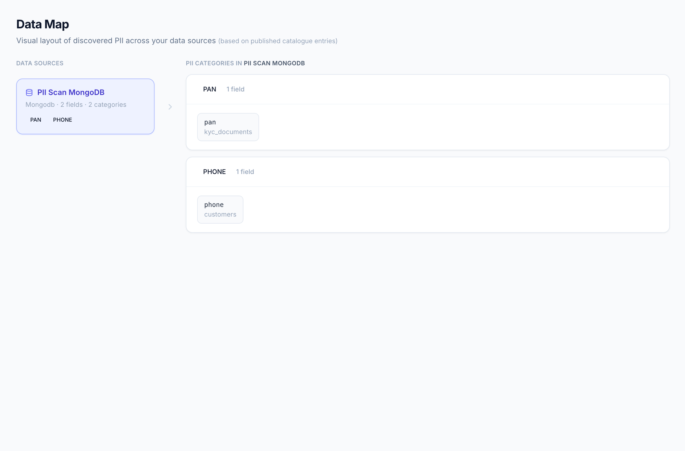
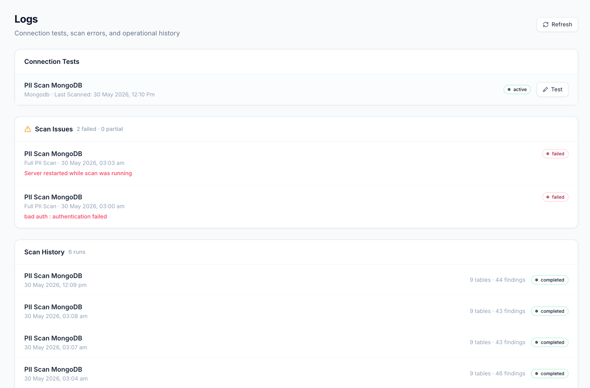

# DataGuard

Scans your PostgreSQL and MongoDB databases for PII. Gives you a UI to review what it finds, confirm or reject findings, and build up a catalogue of where sensitive data actually lives in your system.

Live at: https://data-guard-ten.vercel.app

---

## What it does

Connect a database → configure a scan (which schemas, how many rows to sample) → run it → review the findings → publish the ones you care about to a catalogue.

The scanner samples rows from each column and runs two checks: does the column *name* look like PII (`email`, `pan_no`, `dob`, etc.), and do the actual *values* match known patterns (email regex, Aadhaar format, PAN card format, etc.). Confidence score comes from combining both signals. There's an optional Gemini 2.5 Flash layer that catches things the regex misses.

One thing worth noting — on large tables it doesn't just do `LIMIT 100` from the top. It splits the sample across beginning, middle, and end of the table so you're not just reading seed/test data that was inserted first.

Scans run async. You kick one off and the log streams in the browser in real time. You can also close the tab and come back — the scan keeps running on the backend.

---

## Stack

- Next.js 14 + Tailwind CSS (frontend)
- Node.js + Express (backend)
- PostgreSQL via Supabase (app database)
- Supports scanning PostgreSQL and MongoDB targets

---

## Running locally

Need Node 18+ and a Postgres database.

```bash
git clone https://github.com/MukulSharma24/DataGuard.git
cd DataGuard
```

Backend:
```bash
cd backend
cp .env.example .env
# fill in DB credentials, ENCRYPTION_KEY, JWT_SECRET
npm install
npm run migrate
npm run dev
# runs on :4000
```

Register your first account (becomes admin):
```bash
curl -X POST http://localhost:4000/api/auth/register \
  -H "Content-Type: application/json" \
  -d '{"email":"you@example.com","password":"YourPassword@123"}'
```

Frontend:
```bash
cd frontend
# create .env.local → NEXT_PUBLIC_API_URL=http://localhost:4000
npm install
npm run dev
# runs on :3000
```

---

## Environment variables

Backend (`.env.example` has all of these):

| Variable | Notes |
|---|---|
| `APP_DB_HOST` | Postgres host |
| `APP_DB_PORT` | Postgres port |
| `APP_DB_NAME` | Database name |
| `APP_DB_USER` | DB user |
| `APP_DB_PASSWORD` | DB password |
| `APP_DB_SSL` | Set `true` for Supabase or any cloud DB |
| `ENCRYPTION_KEY` | 64-char hex, used to encrypt stored source credentials |
| `JWT_SECRET` | 64-char hex for auth tokens |
| `CORS_ORIGIN` | Frontend URL |
| `GEMINI_API_KEY` | Optional — enables LLM classification on top of regex |

Frontend needs just one:

```
NEXT_PUBLIC_API_URL=http://localhost:4000
```

---

## Deploying

Frontend → Vercel, point it at the `frontend/` directory, set `NEXT_PUBLIC_API_URL` to wherever your backend lives.

Backend → Railway/Render/Fly, start command is `node src/index.js`. Make sure `CORS_ORIGIN` matches your frontend domain or cookies will break.

---

## PII categories

11 categories: `NAME` `EMAIL` `PHONE` `ADDRESS` `DOB` `GENDER` `AADHAAR` `PAN` `BANK_ACCOUNT` `USER_ID` `CREDENTIAL`

Detection runs on both field names and sample values. The classifier handles camelCase normalization, so `firstName`, `first_name`, and `FIRST_NAME` all resolve the same way. There's also suppression logic for columns that look like PII but aren't — things like `login_count`, `is_active`, `company_name`, `created_at`.

---

## License

MIT

---

## Screenshots

### Overview


### Adding a Data Source


### Scan Profiles




### Scan Runs — Live Log


### Finding Review


### Scan Runs History


### Data Catalogue


### Data Map


### Logs

